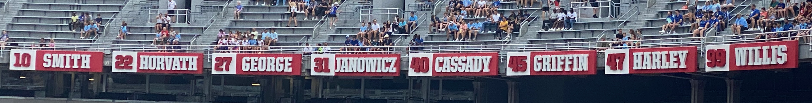

# Stadium-nameplate
Create nameplates in the style of stadium retired numbers signs

This code is designed to create a nameplate in the style of retired player numbers as 
shown in a football stadium.  No supports are needed in the printing, but you will need
to change the filament half way through the name plate and the number plate.  Ideally, 
your printer will need to be able to respond to the M600 command (to change filament).  
Not all printers have this by default, but can be added with a firmware update.

I did my best to match the dimensions of those in the stadium, and I believe I got it 
pretty close with 37mm high by 163mm wide.  This size makes an appropriately sized nameplate.

Unaltered, this file will produce an .stl file with the number 00, the name YOUR NAME, and
a stand to hold the plate.  I recommend you change (below) to your desired number and name, 
then comment out two of the three modules number(), name(), and stand() to create each .stl
file one at a time.  Then use your preferred slicer to mark where the filament change needs 
to take place, and produce the gcode to print.

For Buckeye fans:
The number is scarlet numbers on white background, so start printing with white.  
The name is white letters on scarlet background, so start printing with scarlet.  
And gray makes a good color for the stand.

Of course, you can use any color choices you wish!

Aside the number and name is the Name Length Modifier (nlm). It is designed to add space on 
each side of the name so letters of a short name aren't stretched out too much.  This 
modifier can be negative for use with very long names, but beyond about -12 is too much.
